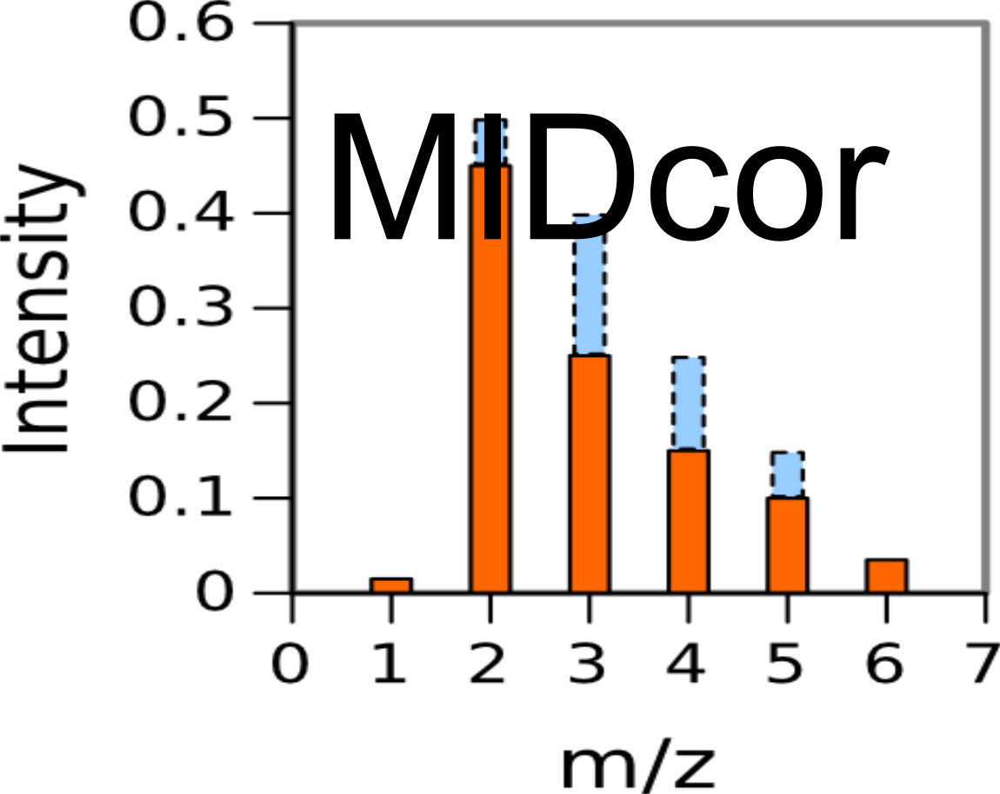
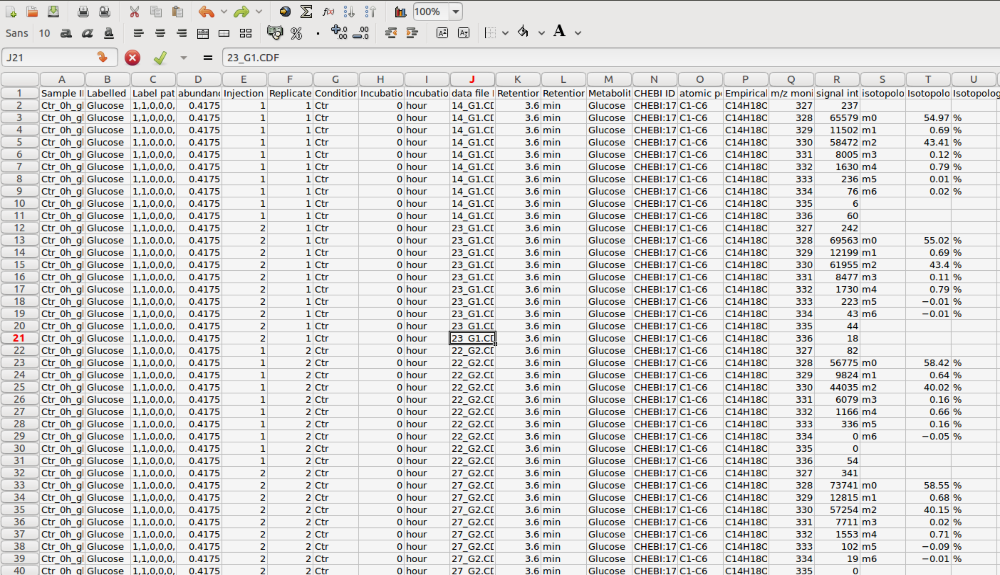

# MIDcor
Version: 1.0
## Short Description

“R”-program that corrects 13C mass isotopomers spectra of metabolites for naturally occurring isotopes and peaks overlapping

## Description

“midcor.R” is an “R”-program that performs a primary analysis of isotopic isomers (isotopomers) distribution obtained by Gas Cromatography coupled with Mass Spectrometry (GCMS). The aim of this analysis is to have a correct distribution of isotopes originated from substrates that are artificially enriched with specific isotopes (usually 13C). To this end the program performs a correction for naturally occurring isotopes and also correction for “impurities” of the assay media that give peaks overlapping with the spectra of analyzed labeled metabolites. This program offers two ways of corrections of “impurities” resulted from overlapping the assayed mass isotopomer distribution with peaks produced either by unknown metabolites in the media, or by different fragments produced by the assayed metabolite. 

## Key features

- primary processing of 13C mass isotopomer data obtained with GCMS

## Functionality

- Preprocessing
- Statistical Analysis
- Workflows

## Approaches

- Isotopic Labelling Analysis / 13C
    
## Instrument Data Types

- MS

## Data Analysis

- correction for H+ loss produced by electron impact, natural occurring isotopes, and peaks overlapping

## Screenshots

- screenshot of input data (format Metabolights), output is the same format with one more column added: corrected mass spectrum



## Tool Authors

- Vitaly Selivanov (Universitat de Barcelona)

## Container Contributors

- [Pablo Moreno](EBI)

## Website

- N/A

## Git Repository

- https://github.com/seliv55/midcor

## Installation

- As independent program. MIDcor itself does not require installation. There are two ways of using it: either creating a library "midcor", or reading source files containing the implemented functions. Standing in the midcor directory:
  
- 1) Create a library of functions:

```
 sudo R 
  
    library(devtools) 

    build() 
       
    install() 
       
    library(midcor)
```

- 2) alternatively, read directly the necessary functions:
  
```
 R 
  
 source("R/midcor.R") 

 source("R/lib.R") 
```

## Usage Instructions

  To run MIDcor independently: standing in the MIDcor directory inside R environment, after reading the sources execute the command:
 
```
 run_midcor(infile, outfile, mode) 
```
 
 here input file should be in Metabolights format, as is shown in the screenshot
 
## two examples provided

 MIDcor uses as input the file prepared by RaMID: 
 
``` 
run_midcor(infile="ramidout.csv", outfile="midcorout.csv",mode="con") 
``` 
 
 Also MIDcor can use as input the file prepared by cdf2mid: 
 
``` 
run_midcor(infile="cdf2midout.csv", outfile="midcorout.csv",mode="con") 
``` 
 
Using the atomic composition of the metabolites, derivatized for gas chromatography, and known natural isotopes composition, MIDcor corrects for naturally occurring isotopes the raw spectra, extracted by RaMID from the CDF files. Moreover, it corrects the possible overlapping of peaks belonging to different substances, as described in [1]. File "midcorout.csv" contains all the data presented in "../RaMID/ramidout.csv" corrected. Further analysis, performed with Iso2flux or Isodyn, consists in simulations of the corrected mass spectra for the specific conditions of the given experiment. "midcorout.csv" can contain data referred to several conditions, e.g. the corrected file produced from CDF collection archived in "roldan.zip" includes data obtained from three cell lines. Since separate simulations needed to reproduce the spectra corresponding to each cell line, MIDcor also separates the data of "midcorout.csv" into the corresponding three files: "A549", "BEAS2B", "NCI". Each of these files is prepared for the subsequent simulation with Iso2flux or Isodyn.

## Publications
- [1] Selivanov VA, Benito A, Miranda A, Aguilar E, Polat IH, Centelles JJ, Jayaraman A, Lee PW, Marin S, Cascante M. MIDcor, an R-program for deciphering mass interferences in mass spectra of metabolites enriched in stable isotopes. BMC Bioinformatics. 2017, 18:88.


